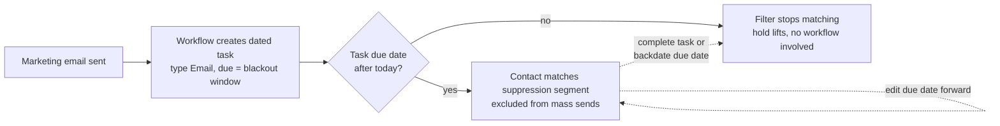

# Rebuilding a 200-workflow portal into maintainable systems

**Client:** Relief (US affiliate of an international humanitarian nonprofit)
**Role:** Solutions Engineer: system design, rebuild, documentation and handover
**Stack:** HubSpot Marketing Hub Enterprise, Salesforce sync, lists, workflows, journeys, tasks, lead scoring

## Context

Relief runs fundraising and advocacy email to a large supporter base out of HubSpot, with donor and
giving data synced in from Salesforce. The portal had accumulated over 200 workflows. Automation had
been added per campaign, per form and per fiscal year, and very little had ever been retired.

The symptom the team felt was that nobody could answer "why did this contact get this email, and why
didn't that one?" without an archaeological dig. The cause was that behavior was distributed across
hundreds of overlapping automations with no ownership boundaries.

## Problem

Four specific failure modes, each of which turned out to be the same class of design error:

1. **Suppression was a boolean flag** written and cleared by many workflows. Contacts got stuck
   suppressed forever when the workflow that was supposed to clear the flag never ran, or got released
   mid-series when a different workflow cleared it early. Nothing owned it, so everything fought over it.
2. **Segmentation logic was nested and inherited.** Lists were defined by reference to other lists,
   several levels deep, so reading a list's actual meaning meant opening four more.
3. **Audience selection was manual per send.** Every campaign rebuilt its audience by hand, so
   targeting quality depended on who built the send.
4. **The Salesforce sync creates one contact per email address**, so a supporter with three addresses
   is three records, and per-person questions could not be answered from record-level data.

## Constraints

- **This is a live fundraising portal.** Nothing could go dark. Revenue depends on the sends going out
  on schedule during the rebuild.
- **The team is not technical.** The rebuild is worthless if it needs me to operate it. Everything had
  to come with a documented procedure and a rollback.
- **Some old objects could not be retired.** One legacy list is referenced in 182 places, and several
  data conditions come from Salesforce fields that HubSpot cannot write.

## What I designed

### Suppression as expiring tasks instead of a shared flag

This is the change I would defend hardest. Temporary email suppression stopped being a boolean
property and became a dated CRM task associated with the contact. The suppression segment is a list
filtered on an associated object: contacts having a task of type Email with a due date after today.

The task does nothing by itself. All of the behavior lives in a list that reads task due dates, and
that indirection is the design. The consequences:

- **A hold expires on its own.** When the due date passes, the filter stops matching. There is no
  workflow whose job is to turn suppression off, and therefore no contact stuck suppressed because
  that workflow failed.
- **Exceptions are one click on one record.** Releasing someone early means completing their task or
  pushing its due date into the past. Holding them longer means editing the date. Neither touches
  automation, so day-to-day exception handling stopped requiring someone who can safely edit a workflow.
- **The task list is a readable log.** Task titles name the stage and email category that created them,
  so "why is this contact suppressed, and how much has this person received lately" is answerable by
  reading their open tasks.
- **Holds are precise.** Due dates are timestamps, so a four-and-a-half day hold is a real thing to
  express rather than something to round.

Anything that can edit a task can now control suppression, with no workflow edits and no shared
property for automations to fight over.

### Adopt rebuilt definitions in place, never by repointing

Ten lists were rebuilt with flat, readable filters to replace nested inherited ones. Putting them into
service is a separate decision from building them, and the method matters more than it looks.

The original of one of them is referenced in 182 places: send exclusions, workflow conditions, nested
lists. Repointing means finding and editing all 182 references, and any one that is missed keeps
silently enforcing the old definition with no way to prove you found them all.

Adopting in place means editing the original list's filters to match the rebuild. The list ID does not
change, so all 182 references keep working untouched and every one of them inherits the new logic at
the same instant. It is one edit instead of 182, and it is atomic.

The hazard it introduces is real and has a procedure: changing filters makes membership churn for a
moment, and any workflow using that list as an enrollment trigger with re-enrollment on will fire on
that churn. So the procedure is to check the list's dependency panel first, pause those workflows,
edit, verify, then un-pause.

### Prove two lists are equal with directional differences

Rebuilt and original lists were never accepted on matching counts. Equal sizes prove nothing about
membership. Acceptance required two temporary lists, "in original, not in rebuild" and "in rebuild,
not in original", and both had to sit at zero. This became the standard test for any claim that two
segments are the same.

### Scoring with a fixed budget

Manual audience building was replaced with a two-axis scoring model, fit and engagement, exposed as a
banded grid so audiences become standing self-updating segments instead of per-send handiwork.

The discipline that makes it work is that group limits must sum to exactly the ceiling. If they sum
higher, everyone with decent signals pins at the maximum and the score stops distinguishing anybody,
which was the state of the model it replaced. If a scoring group is removed, its budget is
consciously reallocated or deliberately left as headroom, rather than quietly abandoned.

Two operational rules came out of building it. Bands hide magnitude: a contact in the lowest band may
have a real but low score or literally zero, and deliverability decisions need the raw number rather
than the band. And the model does not decide everything: major donors do not convert by email, so
their scores inform a relationship manager rather than mass-send inclusion.

### Associate duplicate contacts, never merge them

Given that the Salesforce sync guarantees one record per email address, multi-record supporters are
structural rather than a data quality defect. A detection workflow links them by shared person
identifier and associates, with no merging. Each record keeps its own email, engagement history and
mailability.

That produces a useful asymmetry. Fit is computed from person-level giving data, so it is effectively
shared across a supporter's records. Engagement accrues to whichever address did the opening and
clicking, so it is strictly per-record. A cold record associated to a hot one is usually an abandoned
mailbox rather than a lapsed supporter, which is the opposite of the win-back treatment the old model
would have applied. List filters can then reach across the association, turning "this record" questions
into "this person" questions where it matters.

## Trade-offs

**Journeys versus workflows.** Journeys are cleaner for fixed sequences, but a contact can enroll in
one exactly once, ever, and anyone who exits is out permanently. So recurring series stayed as
workflows, and only genuinely one-time lifecycle sequences became journeys. Journey go-live became a
six-step checklist because the irreversibility deserves one.

**Per-category blackout windows versus one standard window.** The suppression build has one branch per
email category, which gives per-category visibility. The segment does not care how many categories
exist, only whether an unexpired task exists, so this is a knob rather than a commitment. It is
documented as something to collapse if the visibility is not earning its complexity.

**Rebuilt lists sit next to their originals.** Nothing was retired at build time. Adoption is a
separate, reversible, individually verified step, which is slower and much easier to defend on a live
revenue system.

## Outcome

- Suppression has no shared flag left to fight over, no workflow whose failure leaves someone
  permanently suppressed, and per-contact exceptions that a non-technical operator handles in seconds.
- Ten list definitions flattened from nested inheritance to visible local filters, adoptable with one
  edit each rather than up to 182.
- Audience construction moved from per-send manual work to standing segments that re-evaluate as
  engagement decays, with zero manual pruning.
- A band-boundary gap found and closed during the rebuild: giving bands ended at whole dollars while
  the next began one dollar up, and a contact sitting in the gap belonged to no band.

The deliverable was not only the build. It was a handover document plus an operations playbook written
so that each system's owner could take one section and be productive, with every procedure stating how
to verify it worked and how to put it back.

## How it was verified

Every rebuilt segment was verified with the directional difference test described above rather than by
count. Every automation change was checked against the dependency panel before editing, and the
suppression system was validated by watching a full population cycle against the suppression segment
before migrating the next workflow to it. Scoring changes were preceded by a snapshot of the existing
configuration, since the scoring tool keeps no version history and without a snapshot yesterday's model
is unrecoverable.

## What I would do differently

The migration from flag-based to task-based suppression is deliberately incremental, one workflow at a
time, which means both mechanisms coexist for a period and the old flag branch stays in the default
suppression list until the last writer is gone. That is the right risk posture, but it needs a tracked
owner and a finish date, otherwise the portal keeps a dead mechanism forever and I have added
complexity rather than removed it. I would attach a completion criterion to that migration up front.

---

**Related patterns:** [Expiring state beats boolean flags](../patterns/expiring-state-beats-boolean-flags.md) ·
[Edit in place versus repoint](../patterns/edit-in-place-vs-repoint.md) ·
[Directional difference verification](../patterns/directional-difference-verification.md) ·
[Score budget discipline](../patterns/score-budget-discipline.md)
