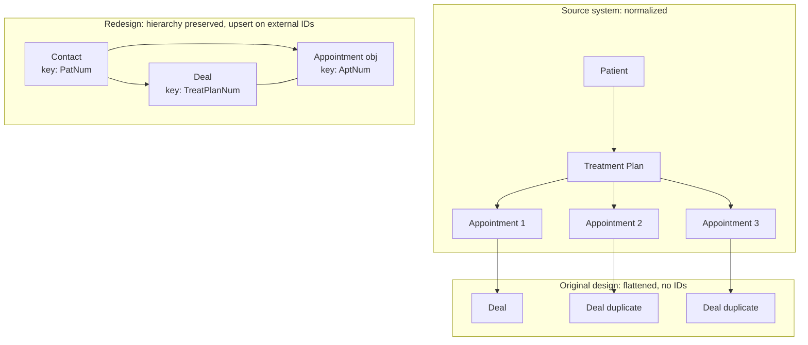

# Post-mortem and redesign of a clinical to CRM integration

**Client:** Surgical (multi-location oral and maxillofacial surgery group)
**Role:** Solutions Engineer: investigation, root cause analysis, and the specification for the rebuild
**Stack:** Open Dental REST API, HubSpot CRM (contacts, deals, appointments, line items), webhook-driven sync

This is the case study about work that failed and had to be diagnosed. The integration was built,
shipped, and produced wrong data in production. I was brought in to establish why and to specify the
replacement.

## Context

Surgical wanted HubSpot to show the full patient journey, from consultation through surgery to final
release, while the practice management system stayed the single source of truth for clinical and
billing data. Practice management data lives in a normalized relational schema:

```
Patient (PatNum)
  └── Treatment Plan (TreatPlanNum)
        ├── Appointment #1 (AptNum)
        ├── Appointment #2 (AptNum)
        └── Appointment #3 (AptNum)
```

The original integration scope was limited to contacts and deals. No other objects, no relational
model.

## Problem

Deals multiplied. The same patient accumulated duplicate deals, appointment data overwrote itself, and
pipeline stages stopped reflecting reality. Reporting on the practice's own patient journey could not
be trusted.

## Investigation

I reviewed the original mappings, standard operating procedures and workflow diagrams against the
practice management system's own API documentation and data model. Four findings, and they compound:

**No relational anchors existed.** The treatment plan identifier had no representation in HubSpot at
all. The patient, appointment and provider identifiers existed but were implemented as editable text
fields rather than immutable unique identifiers. Nothing prevented duplication or mismatch.

**Without unique identifiers, HubSpot could not tell whether an incoming record already existed.** The
sync logic used presence checks rather than identifier matching, roughly "if the patient seems to
exist, update, otherwise create". With no identifier-level reconciliation available, the practical
outcome of that logic was to always create.

**The data model was flattened.** The entire patient hierarchy collapsed into a single deal per
patient, with appointment data written into static date properties:

```
Deal
  ├── Consultation Date  (latest value wins)
  ├── Surgery Date       (latest value wins)
  ├── Post-Op Date       (latest value wins)
  └── Amount             (variable)
```

Three appointments in one treatment plan therefore produced three deals rather than updating one, and
each new appointment payload either created another record or overwrote an unrelated one. Because
webhooks fired on every modification of an appointment or a contact, editing an existing appointment
generated a new deal rather than modifying the existing one.

**The root cause was organizational as much as technical.** The integration was built as a siloed
project, independently of other concurrent work on the same portal and under a separate service
agreement. That separation meant technical decisions were made without cross-team context or review.
One of the compounding behaviors came from an assumption the build team made after repeated
unanswered follow-up questions. The absence of a review path is what turned an ordinary design
question into a production defect.



## Constraints

- **The practice management system stays the source of truth.** HubSpot is a projection of it, and
  must never write back clinical or billing data.
- **The sync must be safe to re-run.** Webhooks retry, backfills happen, and the failure mode being
  fixed is duplicate creation. Idempotency is the requirement, not a nice property.
- **HubSpot has to remain usable by humans.** Sales and marketing own lifecycle, ownership and notes.
  The integration must not overwrite the fields people maintain by hand.

## What I designed

The replacement specification enforces relational equivalence and identifier discipline at every layer.

| Domain object | Source key | HubSpot object | Match key |
|---|---|---|---|
| Patient | `PatNum` | Contact | `patient_id__unique_` |
| Treatment plan | `TreatPlanNum` | Deal | `od_treatment_plan_id` |
| Appointment | `AptNum` | Appointment (standard object) | `od_appointment_id` |
| Treatment plan items | `ProcNum` | Deal line items | `ProcNum` |
| Provider, clinic | `ProvNum`, `ClinicNum` | Resolved deal fields | lookup by ID |

**Every identifier is stored in HubSpot as unique, read-only, and hidden from non-administrators.**
This is what makes everything else possible. An editable identifier is not an identifier.

**One treatment plan is one deal.** A deal is created only when a previously unseen treatment plan
identifier arrives. If the identifier already exists, the operation is an update. Multiple treatment
plans for one patient become multiple deals under one contact, which is the truth, rather than
something to merge away.

**Appointments were promoted to their own object** with their own identifier, associated to the
contact and, when one exists, to the deal. If no deal exists yet the appointment is created standalone
and linked when the deal appears. Many appointments to one treatment plan is now expressible, so
appointment history accumulates instead of overwriting. The date properties on the deal remain as
mirrors for convenience and reporting, and they no longer carry the history.

**Upsert on identifier everywhere,** with a fixed execution order per patient: contact, then
appointments, then treatment plans, then provider and clinic metadata, then financials. Re-running the
sync must never create a duplicate of anything.

**Financials are never inferred from appointments.** Case value is summed from the procedure records
scoped to the treatment plan. Appointments describe scheduling and say nothing reliable about money.

**Identifiers survive contact detail changes.** An email or phone change must not break identity,
because the patient identifier is the permanent key. Records are never deleted in HubSpot when they
disappear from the source, and every failed sync logs its endpoint, payload and target record.

**Provider and clinic are resolved through lookups**, never written as free text, and a failed lookup
skips the write and logs an error rather than falling back to a string. Free text is how two spellings
of one surgeon become two surgeons.

## Trade-offs

**Pipeline stage logic stayed in HubSpot rather than in the integration.** Appointment type and status
drive stage transitions, but the transition rules themselves live in HubSpot automation. Stage
definitions are a business concern that changes often, and putting them in the integration means a
deployment every time the practice renames a stage. The integration supplies facts and HubSpot decides
what they mean.

**A deliberate delay before creating contacts.** New patients are created in the practice management
system before staff have entered the patient identifier, so the sync waits briefly to let that value
land rather than creating an identifier-less contact. This is a compromise with a human workflow, and
it is documented as removable once new contacts stop originating on that side.

**Standard appointment object rather than a custom object.** An earlier revision specified a custom
object. Moving to the standard object gives native UI and reporting support at the cost of less
control over the schema, which was the right trade for a team that has to read these records daily.

## Outcome

The specification defines deterministic sync: one patient is one contact, one treatment plan is one
deal, one appointment is one appointment record, every match runs on an immutable identifier, and
re-running the sync is safe. The duplicate generation, the appointment overwrites and the stage
misalignment are all addressed by the same underlying change, which is that identity is enforced by
unique external identifiers rather than inferred from presence.

## What I would do differently

The finding I keep is not about identifiers, since "use immutable external IDs and upsert" is a thing
everybody already knows. It is that the defect was reachable because the project had no review path.
The build team had questions, asked them more than once, got no answer, and shipped an assumption. A
siloed integration under its own service agreement had no forum where someone with portal context
would have seen the flattened model before it reached production.

So the change I would make is procedural: any integration writing to a shared CRM gets a schema review
against the source system's own data model before implementation begins, and unanswered blocking
questions escalate rather than converting into assumptions. That review would have caught this in an
afternoon, and it would have caught it for free.

---

**Related patterns:** [Idempotent upsert on external IDs](../patterns/idempotent-upsert-on-external-ids.md) ·
[Composite match keys](../patterns/composite-match-keys.md)
