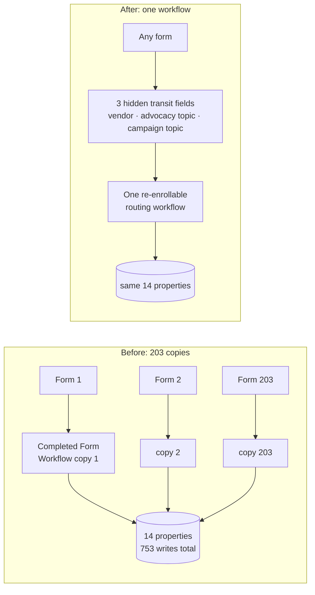

# Collapsing 203 copies of a workflow into one

**Client:** Relief (US affiliate of an international humanitarian nonprofit)
**Role:** Solutions Engineer: analysis, architecture proposal, stakeholder approval, build, cutover
**Stack:** HubSpot forms, workflows and properties, an external advocacy and fundraising platform

## Context

Relief acquires supporters through an external advocacy platform. Every form on that platform has a
matching HubSpot workflow that reads the submission and writes the resulting data onto the contact:
which campaign, which advocacy topic, which acquisition source, whether the lead was paid for.

The pattern was one workflow per form. Over years of campaigns, that produced **203 copies of the
same workflow**, all named some variant of "Completed Form Workflow."

## Problem

I mapped what those 203 workflows actually did. Between them they performed **753 property writes**,
and those writes landed on **14 distinct properties**.

That ratio is the whole finding. This was not 203 different behaviors that happened to be implemented
separately. It was one behavior, copied 203 times, with the campaign-specific values baked into each
copy as literals.

The consequences compound in a way that is familiar from code:

- **Launching a campaign meant building automation.** A marketing task sat behind an engineering
  queue, which is why there were 203 of them rather than someone stopping to think.
- **Changing the behavior meant 203 edits**, and no way to prove you had found them all.
- **The copies had drifted.** Workflows cloned over several years do not stay identical, so the
  question "what happens when someone submits a form" had 203 possible answers and nobody could state
  the general one.
- **Nobody could safely delete any of them**, because each might be the one doing something unique.

## Constraints

- **This is live acquisition.** The forms bring in supporters and paid leads continuously. There is no
  window where submissions can be dropped.
- **Paid-lead attribution is money.** Vendor invoices are reconciled against these fields, so an
  attribution error is a financial error, not a reporting inconvenience.
- **The change needed approval from people who do not read workflows.** Turning off 212 objects in a
  system others depend on is a decision that has to be understood by the people accountable for it.

## What I designed

**One generic, re-enrollable workflow, plus a transit layer.**

The insight is that 203 copies writing 753 times onto 14 properties are not 203 problems. They are one
missing layer of indirection. Each copy existed only to carry a few campaign-specific constants, so if
the submission can carry its own constants, every copy becomes the same workflow.

That is what the transit fields do. **Three hidden fields on the form** carry the vendor, the advocacy
topic and the campaign topic through with the submission. One workflow reads those fields, branches on
the values, and writes the 14 properties. Adding a campaign stops being a build and becomes populating
three hidden fields on a form.

**Re-enrollable, deliberately.** A supporter who submits a second form must be processed again. A
one-shot workflow would silently drop every repeat action, which is most of the engaged population.

**History appends rather than overwrites.** Advocacy topic accumulates rather than being replaced,
because someone who acted on two issues has acted on two issues. This is the rule that decides whether
the consolidated workflow is a faithful replacement or a quiet data loss event.

**Fiscal-year fields isolated from the routing logic.** Paid-lead flags carry a fiscal year. Those
pieces are kept separate so the annual rollover is a checklist that adds the new year's properties and
repoints a handful of actions, rather than a rebuild. Prior-year properties are left untouched as the
historical reporting record.

## The failure mode that nearly shipped

The platform copies values between properties **by internal name, not by label**. If an option is
`VendorName` in one property and `Vendorname` in another, the copy silently produces nothing. No
error, no warning, nothing in any log.

The visible symptom is that some fields on a submission populate and others stay empty, which reads as
a broken integration and is actually a one-character casing difference in a value nobody inspects
because the label looks right. This is what held up the original go-live.

The procedure now says: when adding a vendor, set the label and the internal value deliberately, write
the internal value down, and use the identical string across all three properties. The verification is
to submit a test and read the contact's property history, confirming all three transit fields were
written within a minute of each other. If one gained a value and another did not, the internal names
do not match.

## Trade-offs

**One large branching workflow rather than many small ones.** The single workflow is bigger and its
branch tree has to be read. It is also the only place in the portal that defines what "paid" means,
which is worth more than the readability of any individual branch.

**Transit fields on the form rather than a lookup table.** A lookup keyed on form ID would avoid
hidden fields entirely and would be tidier. It would also mean that adding a campaign requires editing
a table an engineer owns, which reintroduces the queue the whole project existed to remove.

**The legacy workflows were turned off, not deleted.** Off stops enrollment and freezes the objects in
place, so the previous behavior remains inspectable and restorable. Deleting 212 objects the same week
you replace them removes your own ability to answer "what did the old one do?" during the period you
are most likely to be asked.

## Outcome

- **753 property writes across 203 workflow copies mapped** before anything was changed, which is what
  made the argument to stakeholders concrete rather than aesthetic.
- **One re-enrollable routing workflow** replaced the pattern, with three transit fields as the
  indirection layer.
- Orchestration turned on **14 July**; the **212 legacy workflows turned off on 15 July**, a day apart
  so the new path could be observed carrying real traffic before the old one stopped.
- Campaign launches no longer require building automation.

## How it was verified

The mapping came first and was exhaustive: every one of the 203 workflows read, every property write
recorded, before any design was proposed. That inventory is what turned "there are a lot of
workflows" into "753 writes onto 14 properties," and only the second version of that sentence
persuades anyone.

Cutover was sequenced so both systems ran for a day rather than swapping atomically. The new
orchestration was confirmed writing correct values on live submissions before the legacy workflows
were switched off, and the one-day gap was the observation window.

Per-vendor verification is the property-history check described above, which stayed in the SOP because
it catches the one error the design cannot prevent.

## What I would do differently

The transit-field internal names are enforced by a written procedure and a person remembering to follow
it, which works until someone is in a hurry. A scheduled check comparing the option sets of the three
properties and alerting on divergence would catch it without depending on anyone's care, and it is an
afternoon of work. It is the same argument as [case study 11](11-integration-forensics.md): the
control that survives is the one that does not need a human to run it.

---

**Related patterns:** [Edit in place versus repoint](../patterns/edit-in-place-vs-repoint.md) ·
[Map dependencies before changing an enum](../patterns/map-dependencies-before-changing-an-enum.md) ·
[Build the missing trigger](../patterns/build-the-missing-trigger.md)
