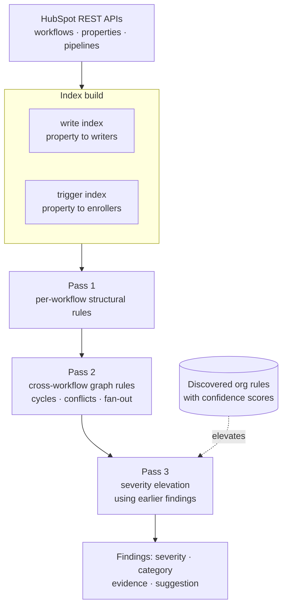

# A static analyzer for a CRM automation graph

**Project:** Troublemaker, a tool I designed and built
**Role:** Sole designer and engineer, from internal prototype to client-authorized installation
**Stack:** Node.js, HubSpot REST APIs, an MCP server, a web reporting UI, later packaged as a Claude Code plugin

This is the case study about building a product rather than designing a system. It is also the only
one here where the artifact is mine rather than a client's.

## Context

Every engagement in this casebook started the same way: open a CRM portal with hundreds of automations
nobody has read in years, and work out what it actually does. [Case study 05](05-portal-rebuild.md)
was a portal with over 200 workflows. [Case study 08](08-workflow-consolidation.md) was 203 copies of
one workflow. In both, the first weeks went into manual archaeology.

That archaeology is mechanical. A person opens each workflow, notes its triggers, notes what it
writes, and holds the cross-references in their head until a pattern appears. It is slow, it does not
scale past a few hundred objects, and it produces findings whose quality depends on how tired the
person was.

It is also, structurally, something a compiler does every day.

## Problem

A CRM automation portal is a graph. Workflows are nodes. A workflow that writes a property which
another workflow triggers on is an edge. Once you accept that framing, the whole catalogue of
classical static analysis becomes available: cycle detection, def-use chains, dead code, unreachable
branches, fan-out analysis, type checking.

Nobody applies it, because the graph lives inside a SaaS product and is only reachable through a REST
API that returns one workflow at a time.

The question the tool answers is the one a new engineer asks on day one and cannot answer for weeks:
**what in this portal is broken, dangerous, or dead?**

## What I designed

### Two inverted indexes over the whole corpus

The core data structure is the same thing a compiler builds. Pull every workflow, then construct:

- a **write index**, mapping each property to every workflow that writes it
- a **trigger index**, mapping each property to every workflow that enrolls on it

Those two indexes are def and use sets. Almost every rule in the catalog is a query over them, which
is why the rules stay simple and the indexes are the part that had to be right.

### A catalog of 25 active rules, numbered to 35

Each rule is specified the same way: what to look for in the API payload, what counts as a hit, an
evidence template, and a suggested remediation. They carry a severity (critical, high, medium, low)
and a category. The categories map onto failure families rather than onto HubSpot features: Loops,
Write Conflicts, Data Integrity, Trigger and Enrollment Logic, Copy and Object Operations, Critical
Property Operations, Performance and Timing, Webhook and External Integration, Communication
Management, Workflow Quality.

A few, with their static-analysis equivalent:

| Rule | What it detects | Classical analogue |
|---|---|---|
| R1 Re-enrollment Loop | A workflow writes a property it also enrolls on, with re-enrollment on | Infinite loop: the write re-satisfies the entry condition |
| R2 / R21 Write Conflict | Two workflows writing the same property under overlapping conditions | Data race on a shared variable |
| R3 State Regression | An automation moves a record backwards through a lifecycle | Illegal state transition |
| R4 Dead Branch | A branch whose condition can never be true | Unreachable code |
| R5 Type Mismatch | A write whose value cannot be valid for the property's type | Type error |
| R15 Blast Radius | A workflow whose writes trigger many downstream workflows | Fan-out analysis |
| R22 / R28 Cross-Copy and Indirect Cycles | Loops that only exist through a chain of workflows | Cycle detection in a directed graph |
| R31 Zombie Workflow | Enrolls and runs but has no effect anyone depends on | Dead code |

R1 is the clearest illustration of why the indexes matter. The hit condition is that a workflow has
re-enrollment enabled, writes to a property, and that same property appears in its own enrollment
criteria. All three facts are cheap once the indexes exist and are expensive to establish by reading.

R15 is the one clients react to most. It counts, for each property a workflow writes, how many other
workflows enroll on that property, and sums. A workflow that writes five properties which collectively
trigger a dozen others means a single enrollment cascades across the portal. That is invisible when
reading workflows one at a time, and obvious the moment the graph exists.

### Three passes, because severity is contextual

Rules do not all run at once. Pass 1 handles per-workflow structural checks. Pass 2 runs the
cross-workflow graph rules that need the complete indexes. Pass 3 **elevates severity using the
findings from the earlier passes**: R20 raises the severity of anything touching a property that
earlier analysis established as critical.

This is what stops the report from being a flat list of 400 equally-shouting items. A write conflict on
an unused property and a write conflict on the property that gates every email send are not the same
finding, and only a later pass knows the difference.

### Rules the organization never wrote down

The second half of the system is the part I would defend hardest, and it came from watching audits get
dismissed.

Most real governance rules in an organization are not in any system. They live in Slack threads, in a
document someone wrote in 2023, in an email where a director said "we never set that field manually."
An audit that only knows structural rules produces findings that are technically correct and
organizationally irrelevant, and a client dismisses the whole report on the strength of two such
items.

So the tool also mines the organization's own communications for governance rules: property-level
signals, process-constraint signals, document types that tend to encode rules, with targeted search
strategies per source. Each candidate rule gets a **confidence score**, and rules are **confirmed by a
human before they count**. Confirmed rules then feed Pass 3, where a structural finding that also
violates a rule the organization actually holds gets elevated.

A finding that says "this workflow overwrites a property" is arguable. A finding that says "this
workflow overwrites a property your director said in March must never be set by automation" is not.

### Feedback as a first-class input

Findings can be marked wrong, and that feedback is recorded against the rule rather than discarded.
Rules that keep producing noise get tightened or disabled. **R26, Dead Workflow, is disabled in the
shipped catalog**, and that is deliberate: it could not distinguish a workflow that is dead from one
that is seasonal, and a rule that cries wolf costs more credibility than it earns findings. Twenty-five
active rules out of thirty-five numbered is not an incomplete catalog. It is ten rules that were tried
and judged.

## Trade-offs

**Read-only, always.** The tool has no write scope. It reports and never remediates. Auto-remediation
in a system where a wrong write cascades across a graph, which the tool itself measures as blast
radius, is a bad trade. A human decides, and the finding carries a suggestion rather than a button.

**A fixed catalog rather than a language model deciding what is wrong.** The rules are deterministic
and auditable: same portal, same findings, and every finding traceable to a numbered rule with a stated
hit condition. Language models are used where judgment genuinely helps, which is reading unstructured
communications for candidate rules and writing recommendations in readable prose. Detection stays
deterministic. A tool that tells a client something different on Tuesday than it said on Monday does
not get installed twice.

**Severity elevation rather than severity assignment.** Rules carry a base severity, and context
raises it. Letting context lower severity would mean the tool could argue itself out of reporting
something, which is the failure mode of every quality gate that ends up switched off.

## Outcome

The tool went from an internal competition entry to something clients authorized against their own
production portals.

- Built first as a workflow auditor with a dependency visualization, then rebuilt as the multi-pass
  analyzer described here.
- **Clients authorized installing it on their production portals**, which is the outcome that actually
  validates it. One asked for it explicitly. Another authorized it as the first step of a full audit
  engagement, and [case study 05](05-portal-rebuild.md) is what that audit turned into. A third
  received their audit as a generated report.
- The audit it produced for one client **became the backlog of a retained engagement**, with each
  finding traceable to a delivered piece of work.
- Repackaged as a Claude Code plugin with an MCP server exposing the portal surface it needs: token
  validation, account and object metadata, workflows and workflow details, properties, pipelines, and
  the core CRM objects.

That last step is the one that changed its nature. As a web app it was a tool I ran. As a plugin with
an MCP server it became something an agent could drive, which turned a report into a conversation:
run the audit, explain a finding, cross-reference the organization's own rules, draft the client
report.

## How it was verified

Against real portals, repeatedly, with the findings reviewed by someone who knew the portal. That is
the only honest test: a rule is good when the person who built the automation reads the finding and
says "yes, and I had forgotten." The feedback loop exists because that review kept producing rule
changes, and R26 is what it looks like when the verdict goes the other way.

## What I would do differently

**No held-out test portal.** Rules were validated against live client portals, where the reviewer knew
the system and could judge. A synthetic portal with deliberately planted defects, one per rule, would
give a regression suite: change a rule, confirm the twenty-five known defects are still caught and no
new false positives appear. Without it, every rule change is verified by judgment, and judgment does
not scale to thirty-five rules.

**The discovered-rules half needs an expiry.** Organizational rules go stale. Someone says in March
that a field is never set manually, and in September that changes, and the confirmed rule keeps
elevating findings based on a policy that no longer exists. Confirmed rules should carry a
confirmation date and be re-verified, rather than being true forever because someone once clicked yes.

---

**Related patterns:** [Provenance-first debugging](../patterns/provenance-first-debugging.md) ·
[Map dependencies before changing an enum](../patterns/map-dependencies-before-changing-an-enum.md) ·
[Build the missing trigger](../patterns/build-the-missing-trigger.md)
