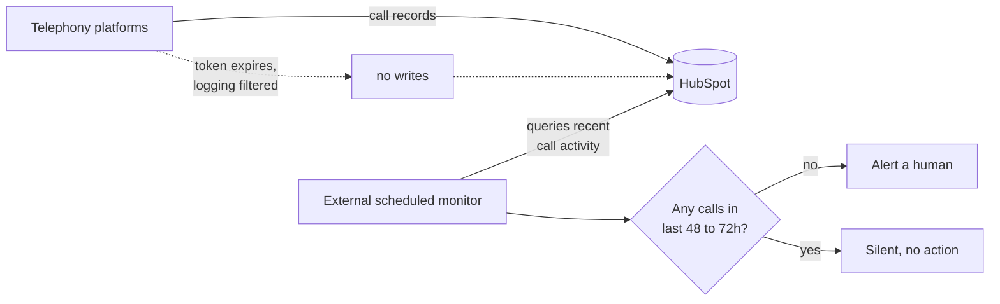

# Diagnosing silent integration failures, and building the alarm

**Client:** Counsel (litigation law firm)
**Role:** Solutions Engineer: investigation, vendor escalation, monitoring build, operating procedure
**Stack:** HubSpot, CallRail, RingCentral, Make.com, a case management platform

## Context

Counsel acquires clients by phone. Calls are the pipeline, so call records in the CRM are how the firm
knows which marketing spend produced which case. Two telephony platforms feed call data into HubSpot
through their own integrations.

## Problem

Calls were missing from the CRM. Not all of them, not consistently, and with no error anywhere.

This is the hardest category of integration failure. A connector that breaks loudly gets fixed the same
day. A connector that logs 80% of calls looks like it is working, and the missing 20% is invisible
because nobody knows what should have been there. The data is wrong in the direction of "less," and
less does not announce itself.

## What I found

Three distinct root causes. They had been read as one flaky integration, which is why it had gone
unresolved.

**A silently expired OAuth token.** The connector's authorization had lapsed. It did not re-prompt, it
did not surface an error in the CRM, it simply stopped writing. From inside HubSpot, an integration
that has stopped writing and an integration with nothing to write are indistinguishable.

**Logging suppressed by inclusion-list configuration.** The telephony platform was configured to log
only calls matching certain criteria. That was a deliberate setting, made once, by someone who is no
longer there, and it silently excluded a category of calls that later mattered. This was not a bug. It
was a stale decision behaving exactly as specified.

**Attribution risk from dynamic number pools.** CallRail's number pools assign tracking numbers to
visitors dynamically to attribute calls to sources. That reassignment means the same number represents
different sources over time, so attributing a late callback to whoever holds that number now is wrong.
This one had not caused a visible failure yet. It is a correctness hazard in how attribution is
computed, and it is the same class of problem as the identifier reassignment in
[case study 01](01-identity-disaggregation.md).

I escalated the first two to both vendors' second-line support with specific, reproducible requests,
including one case built around a response body the API documented and did not return.

## The engineering problem underneath

Every one of these was found by a person noticing something looked off. That is not a detection
mechanism, it is luck with a good reputation.

I looked for a way to make the CRM notice on its own, and there isn't one. **HubSpot has no trigger
for the absence of an event.** Automation fires when something happens. Nothing fires when something
stops happening, and "no calls have been logged since Tuesday" is precisely a non-event.

This is a general gap. Platforms are event-driven, and silence is not an event.

## What I built

**Two monitoring scenarios in Make.com that watch for silence.** They run on a schedule, query recent
call activity, and alert when no calls have been logged within a 48 to 72 hour window. If the
integration stops, somebody hears about it within two days instead of whenever the next person happens
to check a report.

The design points worth keeping:

**The monitor lives outside the system it watches.** A check running inside HubSpot depends on
HubSpot, and shares failure modes with the thing being monitored. Watching from outside is what makes
it a monitor rather than another component that can fail quietly alongside the first.

**It alerts on a threshold, not on each event.** Alerting per missing call is impossible, since the
missing call is exactly what you do not have. Alerting on a window of silence converts an absence into
something observable.

**The window is tuned to the business, not to the technology.** 48 to 72 hours is short enough that a
broken integration is caught before a week of attribution is lost, and long enough that a quiet
weekend does not page anyone. A monitor that cries wolf gets muted, and a muted monitor is worse than
none because it looks like coverage.

**A monthly verification SOP with a recurring task.** This is the part that makes it survive. Monitoring
built by one person and understood by one person stops working when that person leaves. The procedure
says what to check, what healthy looks like, and what to do when it isn't, and a recurring task means
somebody is asked to run it.

## Trade-offs

**A third platform rather than building inside HubSpot.** Make.com is one more thing to maintain and
one more subscription. Building inside HubSpot was not possible, because the missing primitive is the
trigger itself. Given the choice between an external dependency and no detection, external wins.

**Time-window detection rather than reconciliation against the source.** Comparing HubSpot's call
records against the telephony platform's own logs would catch partial loss as well as total loss, and
it is strictly better. It is also a much larger build. The window monitor catches the failure mode
that actually happened twice, and shipped in a day. Reconciliation is the right second version.

**Escalating to vendors rather than working around them.** Slower, and it depends on someone else's
queue. It also fixes the cause rather than the symptom, and the specificity of the escalations is what
made them move.

## Outcome

- Three distinct root causes separated and named, where there had been one unresolved complaint about
  a flaky integration.
- Two vendor escalations filed with reproducible detail rather than "it doesn't work."
- Monitoring in production that alerts within 48 to 72 hours of an integration going silent, covering
  the failure mode that had previously been found by chance.
- A monthly verification procedure with an owner, so the monitoring outlives its author.
- A one-page explanation of which platform is responsible for what, which the client took into their
  own vendor meeting. Several of these failures were possible because nobody could say where one
  system's responsibility ended.

## How it was verified

Each root cause was confirmed by reproducing the gap rather than inferring it: identifying specific
calls that existed on the telephony side and not in the CRM, and tying them to the mechanism that
excluded them. That is also what made the vendor escalations effective, since a support queue can
dismiss a description and cannot dismiss a list of missing records with timestamps.

The monitoring was verified by inducing the condition and confirming the alert fired, which is the only
test that matters for an alarm. An alarm nobody has ever heard is not known to work.

## What I would do differently

I would build the reconciliation version. The window monitor detects total silence, which is the
failure that happened, but partial loss is the failure that is harder to notice and more corrosive:
the integration keeps working, attribution keeps being slightly wrong, and nobody finds out. Comparing
counts between the two systems on a schedule catches both, and the window monitor is a special case of
it.

I would also treat the number-pool attribution hazard as its own piece of work instead of a documented
risk. It had not caused a visible problem yet, which made it easy to leave as a note, and identifier
reassignment is exactly the kind of thing that stays theoretical until it silently is not.

---

**Related patterns:** [Build the missing trigger](../patterns/build-the-missing-trigger.md) ·
[ID reuse is real](../patterns/id-reuse-is-real.md) ·
[Provenance-first debugging](../patterns/provenance-first-debugging.md)
